# Meeting Notetaker — Requirements Draft (historical)

> **Status:** Historical/background only. The authoritative Slice 1 plan is
> `C:\Users\JosephMiguelGuerrero\Downloads\Jira.csv`
> (`/mnt/c/Users/JosephMiguelGuerrero/Downloads/Jira.csv`). Where this document
> conflicts with Jira, Jira wins. In particular, Jira IN-64/IN-69 require
> PyannoteAI transcription + voiceprint identification; do not use this draft to
> reintroduce Azure AI Speech as the primary transcription provider.

**Factor1 Accountants & Advisers · Internal AI & Digital Solutions**
Version 0.2 — Draft for Review · Prepared by Gerd (AI Engineer)

> Markdown copy of the requirements. The `.docx` is the formatted equivalent;
> this file is kept for easy reading, diffing, and reference by Claude Code.

---

## 1. Overview & Purpose

An internal Meeting Notetaker desktop application for Factor1 Accountants &
Advisers. It records or ingests meeting audio, produces an accurate transcript
with named speakers, and generates a meeting summary and structured action items
for review and distribution.

Users are authorised Factor1 staff. Meetings include online calls (Teams, Zoom,
Google Meet, client calls) and face-to-face meetings. Because meetings routinely
involve confidential client financial information, security, privacy, and
data-handling are treated as first-class requirements throughout.

### 1.1 Goals
- Reduce manual note-taking and produce consistent, searchable meeting records.
- Attribute speech to named individuals automatically where possible, with a
  reliable manual fallback.
- Extract action items with owner, deadline, priority and status, tracked in-app.
- Keep confidential client data within Factor1's controlled Azure environment.

### 1.2 Non-Goals (v1)
- Live, in-meeting transcription or captions (batch / post-meeting only).
- Integration with external task tools (e.g. Microsoft Planner, To Do).
- Meeting-bot capture that joins calls as a participant.

---

## 2. Decision Log

Locked decisions for v1. Open items are in Section 10.

| # | Area | Decision |
|---|---|---|
| 1 | Transcription engine | Azure AI Speech, batch / post-meeting (not live). |
| 2 | Diarization | Azure built-in diarization owns "who spoke when"; pyannote is used only to extract voiceprint embeddings and match them to enrolled staff. |
| 3 | Primary database | Azure Database for PostgreSQL (pgvector available if needed later). |
| 4 | Summaries & action items | Azure OpenAI for both dev and production, accessed through a provider-agnostic interface. |
| 5 | Architecture | Thin Electron desktop client + Python/FastAPI cloud backend; the backend is the only component that touches the database. |
| 6 | Audio capture | WASAPI system-audio loopback + microphone mix for in-app recording, with file upload as the always-available fallback. |
| 7 | Access scope | A meeting's notes are private to participants by default; the owner can share to specific people or teams. All access and share changes are audited. |
| 8 | Data retention | Raw audio auto-deletes after 30 days; transcripts/summaries/action items retained per records policy; voiceprints deleted on offboarding; audit log long-retained. |
| 9 | Distribution | In-app dashboard + email via Microsoft Graph after finalisation. No external task-tool integration in v1. |
| 10 | Voiceprint enrollment | Three short clips averaged into one embedding; configurable cosine-similarity threshold; re-enrollment on model upgrade. Consent handled via firm-wide onboarding session. |
| 11 | Packaging (Windows) | electron-builder with an NSIS one-click, per-user installer; binaries code-signed. MSI/Intune deployment noted as a later option if IT requires centrally pushed installs. |
| 12 | Update rollout | electron-updater with a static Azure Blob Storage container as the update feed; updates download in the background and install on app restart; releases published via GitHub Actions. |

---

## 3. System Architecture

The system is split into a thin desktop client and a cloud backend. The client
handles recording, upload, and the review interface only. All processing and all
database access happen in the backend, which is the single security boundary for
client and biometric data.

### 3.1 Components
- **Desktop client (Electron + React)**: authentication, audio capture / upload,
  review-and-edit UI, finalisation, triggering distribution.
- **Backend service (Python / FastAPI)**: orchestrates the pipeline, runs pyannote
  embedding + matching, calls Azure services, enforces access control, and is the
  only component with database credentials.
- **Azure AI Speech**: batch speech-to-text with speaker diarization.
- **pyannote**: voiceprint embedding extraction and similarity matching
  (embedding-only; CPU-tolerable, no GPU required).
- **Azure OpenAI**: summary generation and action-item extraction, behind a
  provider-agnostic interface.
- **Azure Blob Storage**: encrypted audio storage with a 30-day lifecycle policy.
- **Azure Database for PostgreSQL**: voiceprints, transcripts, summaries, action
  items, access control, and audit log.
- **Azure Key Vault**: encryption keys and service secrets.
- **Microsoft Entra ID + Graph**: authentication, meeting attendee lookup, outbound email.

### 3.2 Processing Pipeline
1. Audio is captured or uploaded by the client and stored securely in Azure Blob Storage.
2. The backend submits the audio to Azure AI Speech for batch transcription with
   diarization, returning words plus speaker turns (Speaker 1, 2, 3 …).
3. For each diarized speaker, the backend extracts a pyannote embedding from that
   speaker's audio and compares it against enrolled staff embeddings.
4. Matches above the similarity threshold are labelled by name; anything below
   falls back to "Unknown" and is flagged for manual naming during review.
5. Azure OpenAI generates the meeting summary and extracts action items
   (owner, deadline, priority, status).
6. Results are saved to PostgreSQL and shown in the dashboard for review and editing.
7. After the user finalises, notes are emailed to participants via Microsoft Graph.

> A single mixed audio stream from loopback capture is acceptable for diarization.
> If transcription services are unavailable, audio is queued and retried when restored.

---

## 4. Functional Requirements

### 4.1 Authentication & Authorisation
- Users sign in with their Microsoft (Entra ID) account.
- Only authorised Factor1 users may access the app; others are blocked.
  (Exact authorisation mechanism — see Open Items.)
- The backend enforces per-meeting access on every request via the access-control records.

### 4.2 Voiceprint Enrollment
- Staff only. Clients and external attendees are never enrolled.
- Each enrolling employee records three short clips (~10–15s) of natural speech.
- Clips are converted to one averaged embedding (a fixed-length vector, ~256–512
  floats); the source audio is deleted immediately after extraction.
- Embeddings are stored with the employee ID and the pyannote model version.
- On a pyannote model upgrade, affected staff are flagged for re-enrollment
  (embeddings are not comparable across versions).
- Biometric consent is obtained via a firm-wide onboarding / training session.
  Recommended supporting control: a signed per-person acknowledgment retained by
  HR, so consent is demonstrable under the Data Privacy Act.

### 4.3 Meeting Capture
- **Online meetings**: capture system audio via WASAPI loopback (captures remote
  participants) mixed with the local microphone.
- **Face-to-face meetings**: record the microphone.
- **Fallback for any meeting**: upload a pre-existing recording file.
- Recording controls: start, pause, resume, stop, with a clear active indicator.
- On meeting start, auto-populate title and attendees from Microsoft Graph where
  available (works regardless of meeting platform).

> Risk: WASAPI loopback capture on Windows is the highest-uncertainty component
> and warrants an early proof-of-concept spike. It also captures all system sound
> (notifications, media), which requires user discipline.

### 4.4 Transcription, Diarization & Speaker Identification
- Audio is transcribed in batch by Azure AI Speech with diarization enabled.
- Language / model selection is configurable per meeting to accommodate
  code-switching (e.g. Taglish); the exact configuration is validated on real audio.
- pyannote extracts an embedding per diarized speaker and matches against enrolled
  staff using a configurable cosine-similarity threshold.
- Matched speakers are labelled by name; unmatched speakers are labelled "Unknown"
  and flagged for manual naming.
- Optional quality aid: if two diarized labels both match the same employee above
  threshold, offer to merge them.
- On transcription failure or unavailable services, flag and re-queue for retry.

### 4.5 Summary & Action Items
- Azure OpenAI generates a concise summary from the labelled transcript.
- Action items are extracted as structured records: owner, deadline, priority, status.
- The LLM is accessed through a provider-agnostic interface (swappable backend).

### 4.6 Review, Edit & Finalise
- Users review and edit the transcript, speaker names, and action items.
- All edits are written to a version history / audit log (who, what, when).
- Email distribution occurs only after finalisation — nothing is sent unreviewed.

### 4.7 Distribution & Action-Item Tracking
- Finalised notes are emailed to participants via Microsoft Graph.
- Action items are tracked entirely in-app (owner, deadline, priority, status),
  with a filterable dashboard view.
- No external task-tool integration in v1.

---

## 5. User Interface & Screens

Shared application shell: a top bar (app title, global search across all meetings,
notifications, account avatar) and a left icon rail with five destinations — Home,
Meetings, Action items, People, Settings. Global search lives in the top bar, not
the rail. The design system is in `design-handoff.md`; reference renders are in
`mockups/`. Mockups are the layout/visual authority and are ported to React +
Tailwind, not shipped as-is. All screens support light and dark themes.

### 5.1 Home (dashboard)
- Greeting with current date and the signed-in user's name.
- New meeting card: meeting name input, optional meeting link (used only to
  auto-fill title/attendees via Graph — capture itself is loopback + mic), and the
  primary "Start capturing" action.
- Upcoming meetings: 5-day strip plus today's meetings with time and attendee avatars.
- Recordings: most recent processed meetings as audio-first tiles (waveform
  thumbnail, duration, date).
- Your action items: open items assigned to the user across all meetings, each with
  source meeting, due date, priority, status; overdue items flagged and counted;
  items can be marked done from here.

### 5.2 Meetings (library)
- List of all accessible meetings, grouped by recency (e.g. Today, Earlier this week).
- Filter segmented control (All / Drafts / Finalized) and sort; "New meeting" action.
- Each row: meeting icon, title, client/internal label, date, duration, action-item
  count, status pill (Draft or Finalized), attendee avatars.
- Unresolved unknown speakers surface in the list as an "N to name" flag on the row.
- Opening a row navigates to the meeting review screen.

### 5.3 Meeting review
- Header: title, Draft/Finalized state, date, duration, source; primary actions
  Finalize and Email (email enabled only after finalisation).
- Participants row with named attendees; unmatched speakers shown as a flagged
  "Unknown — name them" chip.
- AI-generated summary block.
- Action items list with owner, due date, priority, status; items owned by an
  unknown speaker show as unassigned.
- Transcript with speaker labels and timestamps; unknown-speaker segments
  highlighted with an inline "Name" action. All edits recorded to the audit log.

### 5.4 Action items (cross-meeting)
- Full list across all accessible meetings, filterable by owner, status, priority,
  overdue; sortable by due date.
- Each item links back to its source meeting; status tracked in-app (no external
  task tool in v1).

### 5.5 People
- Staff list with voiceprint enrollment status (enrolled / not enrolled /
  re-enrollment required after a model upgrade).
- Enrollment flow: record three short clips, extract and store the embedding,
  delete the source audio.
- Management of known speakers; clients/external attendees are never enrolled.

### 5.6 Settings
- Account and sign-out; audio input/capture preferences; language/model defaults
  for transcription; app version and update status.

---

## 6. Data & Storage

### 6.1 Indicative Schema
Core tables (indicative, refined during build):
- **voiceprints** — employee_id, embedding (encrypted vector), model_version, created_at
- **meetings** — id, title, source, owner_id, created_at, status
- **transcripts** — meeting_id, segments (speaker, text, timestamps)
- **summaries** — meeting_id, summary_text, generated_at
- **action_items** — meeting_id, owner, description, deadline, priority, status
- **meeting_access** — meeting_id, user_id, role (owner / editor / viewer)
- **audit_log** — actor, action, target, before/after, timestamp

### 6.2 Retention Policy

| Artifact | Retention | Mechanism |
|---|---|---|
| Raw meeting audio | 30 days, then auto-delete | Azure Blob lifecycle policy |
| Enrollment audio | Deleted after embedding extraction | Backend, immediate |
| Transcripts / summaries / action items | Retained per Factor1 records policy | Database; policy TBD |
| Voiceprints | Until employee offboarding | Deletion on offboarding |
| Audit / edit log | Long retention | Database; policy TBD |

> Exact durations for notes and audit logs are a compliance decision for Factor1's
> data-policy owner; the values above are engineering defaults.

---

## 7. Security, Privacy & Compliance

- All processing and storage stay within Factor1's Azure environment; client data
  does not leave the tenant.
- The backend is the sole holder of database credentials; desktop clients never
  access the database directly.
- Azure Blob and PostgreSQL are encrypted at rest by default; voiceprint embeddings
  receive additional application-layer encryption, with keys in Azure Key Vault.
- Voiceprints are biometric data and treated as sensitive personal information under
  the PH Data Privacy Act: collected with consent, restricted to the matching
  service, access-logged, and deleted on offboarding.
- A voiceprint cannot be used to reconstruct a person's voice; it is a numeric vector.
- Meeting-recording consent is the responsibility of the meeting owner; enrollment
  (biometric) consent is handled separately via onboarding.
- All edits, access grants, and share changes are recorded in the audit log.

> Engineering intent, not legal advice. Factor1's compliance owner should review and
> sign off, particularly on consent records and client-data handling for any non-PH clients.

---

## 8. Packaging, Distribution & Updates

### 8.1 Packaging (Windows)
- Packaged with electron-builder producing an NSIS one-click installer, installed
  per-user (no administrator rights required).
- All release binaries are code-signed. An organisational code-signing certificate
  (OV certificate or Azure Trusted Signing) must be procured before first release;
  unsigned builds trigger SmartScreen warnings and degrade silent updates.
- MSI packaging for centrally pushed deployment (Intune / Group Policy) is out of
  scope for v1 but noted as a follow-up if IT requires managed rollout.

### 8.2 Update rollout
- Automatic updates use electron-updater. The update feed is a static Azure Blob
  Storage container holding the latest installer and `latest.yml` — no update server
  to operate, and the feed stays inside the Factor1 Azure tenant.
- Behaviour: the app checks the feed on launch (and periodically), downloads new
  versions in the background, and installs on next restart. Users can also trigger a
  check from Settings.
- Releases are built and published from GitHub Actions: tagging a release builds,
  signs, and uploads the installer and metadata to the Blob feed.
- Versioning is semantic (MAJOR.MINOR.PATCH). The backend API is versioned
  independently; the app sends its version with API calls so the backend can warn on
  incompatible clients.
- Rollback: previous installers are retained in the Blob container; rolling back
  means re-pointing `latest.yml` at the prior version.

> Client machines must reach the Blob update endpoint; if Factor1 restricts outbound
> traffic, the update URL should be allow-listed.

---

## 9. Process Flow

1. Open app → sign in with Microsoft → authorisation check.
2. First-time staff: optional voiceprint enrollment (3 clips → embedding → encrypted store).
3. Start or upload a recording; auto-fill title/attendees from Graph where available.
4. Capture (loopback + mic for online, mic for in-person) or upload → store audio encrypted.
5. If services available: transcribe + diarize; otherwise queue and retry.
6. pyannote matches speakers → name or "Unknown" (manual naming).
7. Generate summary + action items → save to database.
8. Review / edit (all changes logged) → finalise.
9. Email participants via Microsoft Graph; track action items in-app.

---

## 10. Open Items — To Decide

Do not block starting the build, but resolve before the related component is implemented.

| Item | Question to resolve | Blocks |
|---|---|---|
| Authorised-user definition | How does the app decide who is allowed in — e.g. membership of a specific Entra ID security group? | Auth |
| Calendar / attendee auto-fill | Scope of Microsoft Graph integration for title/attendees; behaviour when no calendar event exists. | Capture |
| Audit log contents | Exact set of events to record and the log's retention duration. | Review / compliance |
| Non-functional limits | Maximum meeting length, supported languages / model config for Taglish, error-handling and notification UX. | Pipeline / UX |
| Notes & audit retention | Concrete retention durations (compliance owner sign-off). | Retention |
| Similarity threshold | Final cosine-similarity cutoff, tuned on real Factor1 audio. | Speaker ID |
| Code-signing certificate | OV certificate vs Azure Trusted Signing, and procurement owner; required before first release. | Packaging |

---

## 11. Key Risks

| Risk | Description | Mitigation |
|---|---|---|
| Loopback capture on Windows | WASAPI system-audio capture is fiddly and the most likely source of unexpected effort. | Early proof-of-concept spike; upload fallback always available. |
| Taglish / code-switching | Mixed-language speech can degrade transcription and diarization accuracy. | Per-meeting model/language config; validate on real audio. |
| Speaker mismatch | Diarization may merge or split speakers, muddying voiceprint matches. | Graceful fallback to "Unknown" + manual naming; merge-on-same-match aid. |
| Biometric compliance | Voiceprints are sensitive data with consent and retention obligations. | Onboarding consent + signed acknowledgment; encryption; offboarding deletion. |
| Client-data confidentiality | Meeting content is confidential client information. | All processing in-tenant; no external LLM/task vendors in v1. |

---

## Appendix A — Flowchart (Mermaid)

```mermaid
flowchart TD
    A[User opens desktop app] --> B[Login with Microsoft account]
    B --> C{Authorized company user?}
    C -- No --> D[Block access]
    C -- Yes --> EC{Voiceprint enrolled?}

    EC -- No --> EN[Record enrollment samples - employee only]
    EN --> EX[Extract embedding via pyannote - averaged vector]
    EX --> ENC[Encrypt vector]
    ENC --> EDB[(Voiceprint DB: employee_id, embedding, model_version)]
    EC -- Yes --> HOME[App home / dashboard]
    EDB --> HOME

    HOME --> E[Start or upload meeting recording]
    E --> CAL[Pull title + attendees from MS Graph if available]
    CAL --> F{Meeting source}
    F --> G[Teams / Zoom / Google Meet / online call]
    F --> H[Face-to-face meeting]
    G --> I[Capture system audio loopback + mic, or upload]
    H --> J[Record microphone audio or upload file]
    I --> K[Save audio to Azure Blob - encrypted, 30-day auto-delete]
    J --> K

    K --> SVC{Transcription services available?}
    SVC -- No --> QUEUE[Queue audio - retry when restored]
    QUEUE --> SVC
    SVC -- Yes --> L[Azure AI Speech: transcribe + diarize - batch]
    L -- Failure --> RQ[Flag + re-queue for retry]
    RQ --> SVC

    L --> M[Speaker turns: Speaker 1, 2, 3 ...]
    M --> N[pyannote embedding per speaker -> match enrolled staff]
    N --> O{Match found?}
    O -- Yes --> P1[Label speaker by name]
    O -- No --> P2[Label as Unknown - flag for manual naming]
    P1 --> P[Full transcript with speaker labels]
    P2 --> P

    P --> Q[Azure OpenAI: meeting summary]
    P --> R[Azure OpenAI: extract action items]
    R --> S[Owner, deadline, priority, status]
    Q --> T[Save to Azure PostgreSQL]
    S --> T

    T --> U[Show results in dashboard]
    U --> W[Review/edit transcript, names, action items]
    W --> AUD[(Audit log: who / what / when)]
    AUD --> X[Finalize meeting notes]

    X --> V[Email participants via MS Graph]
    X --> TRK[Track action items in-app]
    V --> Z[Done]
    TRK --> Z
```

